# Elementos HTML Comunes
Esta lectura te introducirá a los elementos HTML más comunes que necesitas conocer como desarrollador web. Los elementos HTML descritos en esta lectura son clave para tu aprendizaje.
Tiempo estimado necesario: 25 minutos

> #### **Objetivos**
> 1.	Usar títulos y encabezados para etiquetar información
> 2.	Insertar texto utilizando el elemento de párrafo
> 3.	Insertar saltos de línea en una página
> 4.	Agregar enlaces a diferentes secciones de una página y a otras páginas
> 5.	Crear una lista de elementos
> 6.	Agregar una tabla de datos
> 7.	Insertar una imagen

### Configuración HTML
Recuerda que un documento HTML siempre debe comenzar especificando el DOCTYPE. Todo el contenido se encierra luego dentro de una etiqueta `<html>`. Dentro de esta etiqueta, el contenido se divide en los elementos `<head>` o `<body>` del código. La etiqueta `<head>` contiene todos los metadatos sobre la página, y la etiqueta `<body>` contiene el contenido que se muestra al usuario final.
Según esta configuración, un documento HTML vacío sin contenido ni metadatos debería verse de la siguiente manera: 
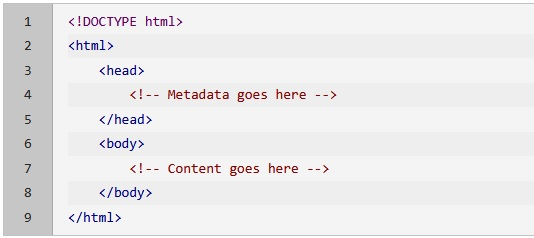

### Título de la pestaña del navegador
El título de la página aparece en la pestaña del navegador cuando abres una página web en el navegador. Por ejemplo, si abres Google en una nueva pestaña, el título del navegador se mostrará como “Google” junto con el logo de Google.
Puedes definir el título del navegador utilizando la etiqueta `<title>`, que se coloca dentro de la sección `<head>` de tu marcado HTML de la siguiente manera: 
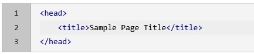

### Encabezados de Página
Puedes separar tu información en diferentes secciones utilizando encabezados, como se puede ver en esta lectura. HTML define seis tamaños de fuente diferentes para los encabezados. Cada encabezado representa un nivel diferente de importancia y tamaño de texto.
Los encabezados HTML se definen con las siguientes etiquetas: `<h1>`, `<h2>`, `<h3>`, `<h4>`, `<h5>`, y `<h6>`. El número en estas etiquetas especifica la importancia, siendo `<h1>` el encabezado más grande y `<h6>` el encabezado más pequeño.
Dado que este elemento define el contenido dentro de una página web, debe colocarse en la sección `<body>` de tu marcado de la siguiente manera: 
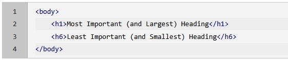

### Agregar Texto
La etiqueta `
` debe usarse para insertar texto en tu documento HTML. Este elemento significa párrafo e incluye cualquier contenido de texto, ya sea una sola palabra o un ensayo de 10 páginas.
Dado que este elemento define contenido dentro de una página web, debe colocarse en la sección `<body>` de tu marcado de la siguiente manera: 
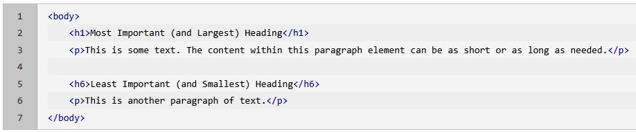

### Usando Saltos de Línea
Un salto de línea se utiliza para completar una línea y continuar el texto restante al inicio de una nueva línea, como se hizo aquí.
Esto puede ser útil en muchos escenarios, como al escribir direcciones. Puedes usar la etiqueta ` ` para insertar un salto de línea en HTML. Esta no es una etiqueta contenedora y, por lo tanto, no tiene una etiqueta de cierre.  
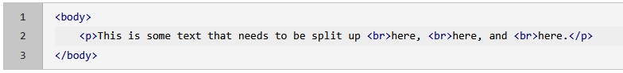

### Agregar Enlaces a Otras Páginas
Las páginas web pueden enlazar a otras páginas o a otros lugares en la misma página a través de un hipervínculo. La etiqueta `<a>` define un hipervínculo en HTML, seguida del atributo href para definir la dirección de destino del hipervínculo.
Los hipervínculos se insertan normalmente en el texto de modo que al hacer clic en algún texto hipervinculado, te lleva al destino. Por ejemplo, si deseas hipervincular la palabra “IBM” al sitio web oficial de IBM, puedes usar la etiqueta `<a>` con el atributo href como se muestra a continuación:  
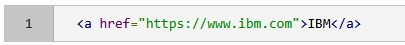
 
En el ejemplo anterior, cada vez que un usuario hace clic en el texto “IBM”, se abrirá el sitio web de IBM en la pestaña actual.
Si deseas que un hipervínculo abra un destino determinado en una nueva pestaña, puedes hacerlo añadiendo `target="_blank"` a la etiqueta <a> de la siguiente manera:  
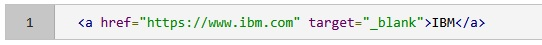
             
Los hipervínculos también pueden enlazar a otros lugares en la misma página. Puedes enlazar a la parte superior de la página actual de las siguientes dos maneras:  
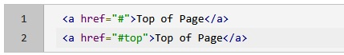
 
Para enlazar a una sección diferente de la página, puedes usar el id de la sección a la que deseas enlazar, de la siguiente manera:  
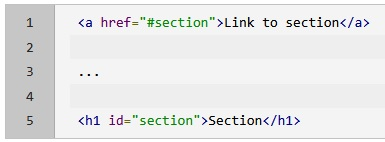
 
### Crear una lista
Para crear una lista de elementos, puedes usar la etiqueta `<ol>` (lista ordenada) para listas numeradas y la etiqueta `<ul>` (lista desordenada) para listas con viñetas.
Cada punto dentro de una lista estará encerrado por una etiqueta de apertura y cierre `<li>`, que representa un elemento de lista. Esta misma etiqueta se utiliza tanto para listas ordenadas como desordenadas.  
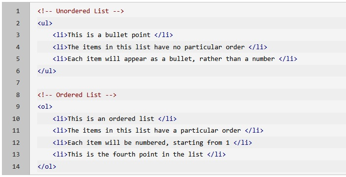
 
### Agregar una Tabla
Las tablas son a menudo necesarias para formatear datos, como se muestra a continuación.
 
Una tabla se crea con HTML utilizando la etiqueta `<table>`. Dentro de la tabla, cada fila de datos se representa utilizando la etiqueta `<tr>` (fila de tabla). Los encabezados de columna o fila se pueden especificar mediante el elemento `<th>` (encabezado de tabla). Finalmente, cada elemento de datos dentro de las celdas de la tabla se especifica utilizando la etiqueta `<td>` (datos de tabla).  
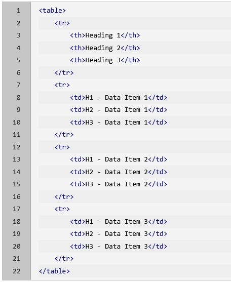
 
### Agregar una Imagen
Las imágenes se pueden agregar dentro de una página web utilizando la etiqueta ``. Se pueden usar tanto imágenes externas (por ejemplo, de internet) como imágenes locales (por ejemplo, archivos guardados en tu computadora) en esta etiqueta.
Para agregar una imagen, necesitas conocer el nombre del archivo de imagen e incluirlo en el atributo ‘src’. El atributo ‘src’ especifica un recurso externo al que deseas vincular, como la URL de una imagen. Si estás haciendo referencia a un archivo en línea, puedes insertar la URL de la imagen en este atributo. Si deseas insertar una imagen local, debes insertar la ruta del archivo de la imagen en relación con la ubicación de tu archivo HTML.
La etiqueta `` también requiere el atributo ‘alt’, que define un texto alternativo que se mostrará en caso de que la imagen no se pueda cargar y cuando se utiliza un lector de pantalla.
El tamaño de una imagen también se puede (opcionalmente) especificar utilizando los atributos ‘width’ y ‘height’, con los números indicados en píxeles.  
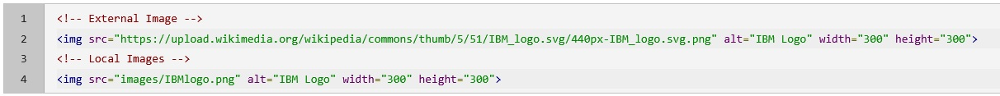
 
#### ¡Felicitaciones!
Has aprendido sobre algunos de los elementos HTML más comunes que estarás utilizando como desarrollador web. Siéntete libre de consultar esta página como referencia al crear tus propios documentos HTML.
