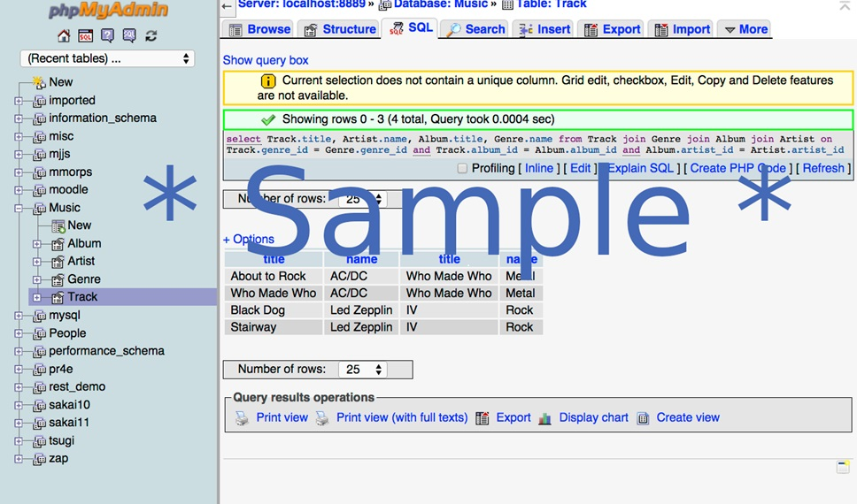

# Especificaciones de la asignación: Bases de Datos de tablas múltiples (pistas)

Creará una copia de la base de datos "Música" que se trata en la lección. Completarás tu base de datos con pistas, artistas, álbumes y géneros diferentes a los utilizados en clase. Debe incluir tres artistas, cinco álbumes y 20 pistas en sus datos. Elige un género para cada pista. Sus tablas deben normalizarse como se describe en clase.
Luego debe construir y ejecutar algunas consultas en sus datos y luego tomar capturas de pantalla de esas consultas y enviar las capturas de pantalla como su tarea.

## Envío de su tarea
Para este trabajo entregará:
* Captura de pantalla (JPG o PNG) de datos en la tabla de TRACK
* Captura de pantalla (JPG o PNG) de todos los datos reunidos ordenados en orden ascendente por el título del álbum
* Captura de pantalla (JPG o PNG) de todos los géneros de un artista en particular. Sugerencia: use JOIN, DISTINCT y WHERE

## Calificación
Esta es una tarea relativamente simple. No quites puntos por pequeños errores. Si tus compañeros parecen haber hecho la tarea, dales todo el crédito. Siéntase libre de hacer sugerencias si hay pequeños errores. Por favor mantenga sus comentarios positivos y útiles. Si no toma en serio las calificaciones, los instructores pueden eliminar su respuesta y perderá puntos.

## Capturas de pantalla de muestra
 
 

 

## Desafíos opcionales
Esta sección es completamente opcional y está aquí en caso de que desee explorar un poco más a fondo y ampliar sus habilidades de código. No hay nada que entregar para este desafío.
Cree una consulta usando GROUP BY para mostrar la cantidad de pistas que tiene un artista en cada género. No es necesario que entregue una captura de pantalla de esta consulta.
 

## Nota sobre los recursos:
La sección 'Recursos' contiene enlaces a los capítulos del libro y el folleto del código SQL utilizado en la lección. Para esta semana, la sección 'Recursos' se puede encontrar en:
https://www.coursera.org/learn/intro-sql/resources/EUDlf

