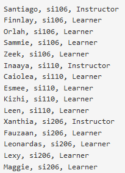
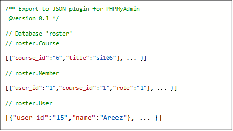
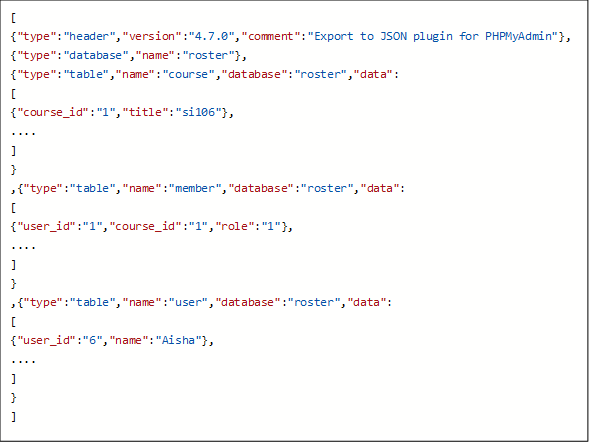
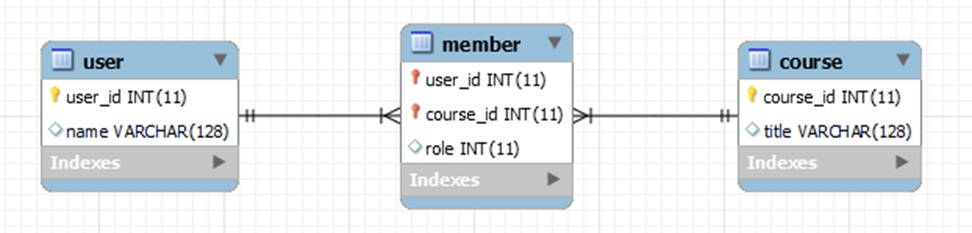
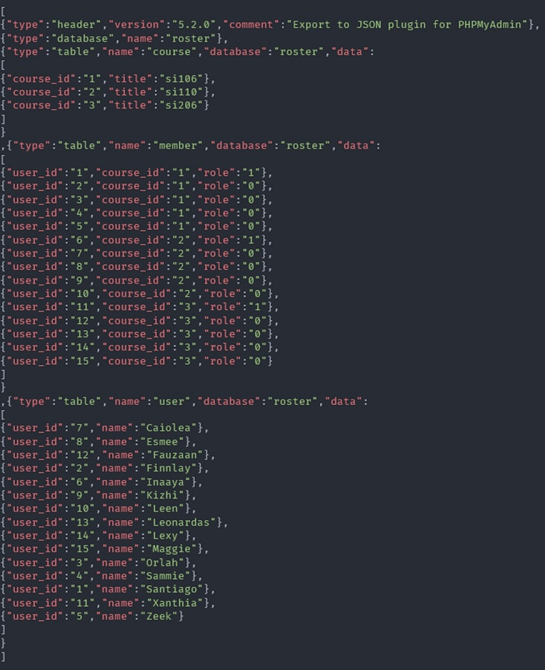

# Especificaciones de asignación: bases de datos de muchos a muchos

Realice las instrucciones a continuación y cargue su exportación JSON de la base de datos resultante en su página de asignación individual.

## Tablas para la Asignación
Cree las siguientes tablas en una base de datos denominada "roster". Asegúrese de que su base de datos y tablas se nombren exactamente de la siguiente manera, incluido el caso coincidente.

~~~
DROP TABLE IF EXISTS Member;
DROP TABLE IF EXISTS `User`;
DROP TABLE IF EXISTS Course;
~~~

~~~
CREATE TABLE `User` (
    user_id     INTEGER NOT NULL AUTO_INCREMENT,
    name        VARCHAR(128) UNIQUE,
    PRIMARY KEY(user_id)
) ENGINE=InnoDB CHARACTER SET=utf8;
~~~

~~~
CREATE TABLE Course (
    course_id     INTEGER NOT NULL AUTO_INCREMENT,
    title         VARCHAR(128) UNIQUE,
    PRIMARY KEY(course_id)
) ENGINE=InnoDB CHARACTER SET=utf8;
~~~

~~~
CREATE TABLE Member (
    user_id       INTEGER,
    course_id     INTEGER,
    role          INTEGER,
    CONSTRAINT FOREIGN KEY (user_id) REFERENCES `User` (user_id)
      ON DELETE CASCADE ON UPDATE CASCADE,
    CONSTRAINT FOREIGN KEY (course_id) REFERENCES Course (course_id)
      ON DELETE CASCADE ON UPDATE CASCADE,
    PRIMARY KEY (user_id, course_id)
) ENGINE=InnoDB CHARACTER SET=utf8;
~~~
  
## Ejemplo: Datos
Normalizará los siguientes datos (cada usuario obtiene datos diferentes en la página del calificador automático) e insertará los siguientes elementos de datos en su base de datos, creando y vinculando todas las claves externas correctamente. Codifique el instructor con un rol de 1 y un alumno con un rol de 0.

 
Puede probar para ver si sus datos se han ingresado correctamente con la siguiente instrucción SQL.

~~~
SELECT User.name, Course.title, Member.role
FROM User JOIN Member JOIN Course
ON User.user_id = Member.user_id AND Member.course_id = Course.course_id
ORDER BY Course.title, Member.role DESC, User.name
~~~

El orden de los datos y el número de filas que devuelve esta consulta debe ser el mismo que el anterior. No debe haber datos faltantes o adicionales en su consulta.

## Envío de su tarea
Cuando haya insertado todos los datos, use phpMyAdmin para exportar los datos de la siguiente manera:
* Seleccione la base de datos (no seleccione una tabla dentro de la base de datos)
* Seleccione la pestaña Exportar
* Seleccione "Personalizar - mostrar todas las opciones posibles"
* Seleccione "Guardar salida en un archivo" (Custom - display all possible options)
* Establezca el formato en JSON
* No seleccione "pretty print" la salida
* Deje todo lo demás como predeterminado y ejecute la exportación.

La salida estará en un archivo llamado "roster.json" que debería tener el siguiente aspecto: Dependiendo de la versión de phpMyAdmin, hay 2 formatos que exporta.

Es un formato algo extraño: es un bit de JSON para cada tabla. No necesita editar o incluso mirar este archivo. Simplemente súbalo arriba.

# SOLUCIÓN

## DIAGRAMA

### Insertamos los usuarios
~~~
INSERT INTO User (name) VALUES ('Santiago');
INSERT INTO User (name) VALUES ('Finnlay');
INSERT INTO User (name) VALUES ('Orlah');
INSERT INTO User (name) VALUES ('Sammie');
INSERT INTO User (name) VALUES ('Zeek');
INSERT INTO User (name) VALUES ('Inaaya');
INSERT INTO User (name) VALUES ('Caiolea');
INSERT INTO User (name) VALUES ('Esmee');
INSERT INTO User (name) VALUES ('Kizhi');
INSERT INTO User (name) VALUES ('Leen');
INSERT INTO User (name) VALUES ('Xanthia');
INSERT INTO User (name) VALUES ('Fauzaan');
INSERT INTO User (name) VALUES ('Leonardas');
INSERT INTO User (name) VALUES ('Lexy');
INSERT INTO User (name) VALUES ('Maggie');
~~~

### Insertamos los cursos
~~~
INSERT INTO Course (title) VALUES ('si106');
INSERT INTO Course (title) VALUES ('si110');
INSERT INTO Course (title) VALUES ('si206');
~~~

### Normalizamos los datos de la tabla Member
~~~
INSERT INTO Member (user_id, course_id, role) VALUES (1, 1, 1);
INSERT INTO Member (user_id, course_id, role) VALUES (2, 1, 0);
INSERT INTO Member (user_id, course_id, role) VALUES (3, 1, 0);
INSERT INTO Member (user_id, course_id, role) VALUES (4, 1, 0);
INSERT INTO Member (user_id, course_id, role) VALUES (5, 1, 0);
INSERT INTO Member (user_id, course_id, role) VALUES (6, 2, 1);
INSERT INTO Member (user_id, course_id, role) VALUES (7, 2, 0);
INSERT INTO Member (user_id, course_id, role) VALUES (8, 2, 0);
INSERT INTO Member (user_id, course_id, role) VALUES (9, 2, 0);
INSERT INTO Member (user_id, course_id, role) VALUES (10, 2, 0);
INSERT INTO Member (user_id, course_id, role) VALUES (11, 3, 1);
INSERT INTO Member (user_id, course_id, role) VALUES (12, 3, 0);
INSERT INTO Member (user_id, course_id, role) VALUES (13, 3, 0);
INSERT INTO Member (user_id, course_id, role) VALUES (14, 3, 0);
INSERT INTO Member (user_id, course_id, role) VALUES (15, 3, 0);
~~~

### roster.json

