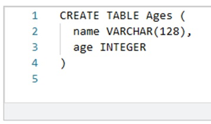
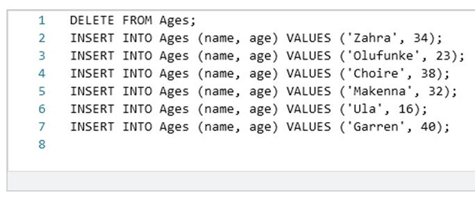
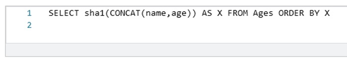
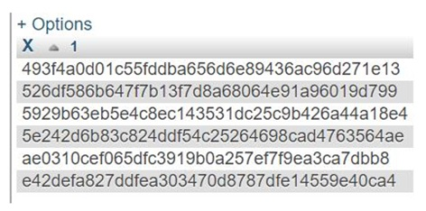

# Especificaciones de asignación: SQL de tabla única
## Tutorial de ejemplo para la tarea
Realice las instrucciones a continuación e ingrese el código que obtiene en la siguiente tarea. (Pista: comienza con 493)

## Especificaciones
Primero, cree una base de datos MySql o use una base de datos existente (asegúrese de usar un conjunto de caracteres UTF8) y luego cree una tabla en la base de datos llamada "Edades":
 
 Luego, asegúrese de que la tabla esté vacía eliminando las filas que insertó anteriormente e inserte estas filas y solo estas filas con los siguientes comandos:
 
 Para la tarea, use los datos en su página individual de autoevaluación, no los datos de muestra anteriores.
Una vez realizadas las inserciones, ejecute el siguiente comando SQL:
 
 Busque la primera fila en el conjunto de registros resultante e ingrese la cadena larga que parece 254c6127cdbc4c38e065317667340e8b0950046f (esta es solo una cadena de muestra). Usa la pista como guía.
Ejemplo de salida de datos:
 
 ## Nota sobre los recursos:
La sección 'Recursos' contiene enlaces a los capítulos del libro y el folleto del código SQL utilizado en la lección. Para esta semana, la sección 'Recursos' se puede encontrar en: https://www.coursera.org/learn/intro-sql/resources/uSpSe
