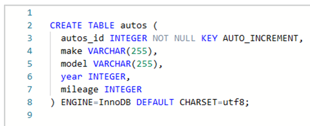
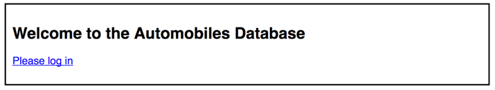
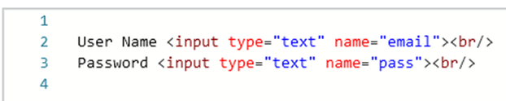
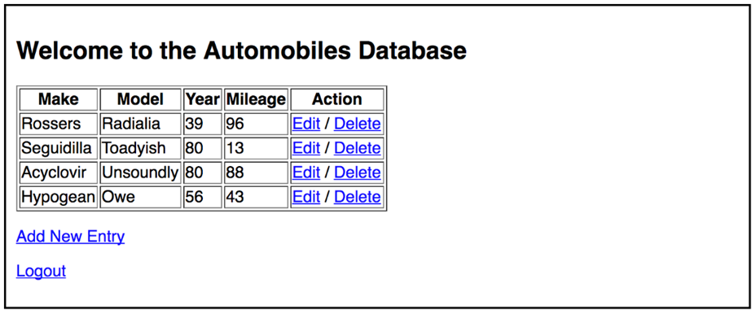
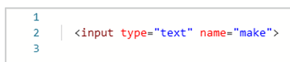
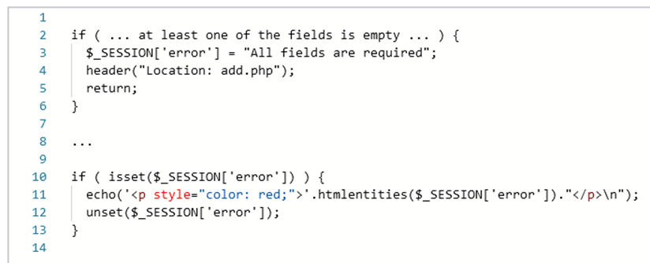
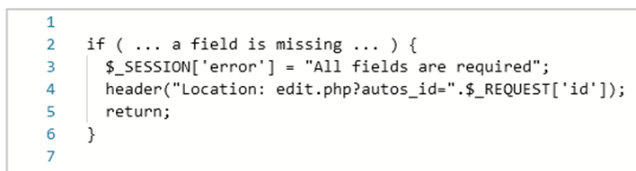

# Autos C.R.U.D.
Creará una aplicación basada en web para rastrear datos sobre automóviles.

## Código de muestra
El código de muestra de la conferencia CRUD es una aplicación CRUD de trabajo simple: 
http://www.wa4e.com/code/crud.zip

## Especificaciones generales
Aquí hay algunas especificaciones generales:
* Su nombre debe estar en la etiqueta de título del HTML para todas las páginas de esta tarea.
* Todos los datos que provienen de los usuarios deben escaparse correctamente mediante la función htmlentities() en PHP. No necesita escapar del texto generado por su programa.
* Debe seguir el patrón POST-Redirect-GET para todas las solicitudes POST. Esto significa que cuando su programa recibe y procesa una solicitud POST, no debe generar ningún HTML como respuesta HTTP a esa solicitud. Debe usar la función "header('Location: ...');" y "return" para enviar el encabezado de ubicación y redirigir el navegador a la misma página o a una diferente.
* No utilice la validación de datos HTML5 en el navegador (es decir, type="number") para los campos de esta tarea, ya que queremos asegurarnos de que pueda realizar correctamente la validación de datos del lado del servidor. Y, en general, incluso cuando realiza la validación de datos del lado del cliente, aún debe validar los datos en el servidor en caso de que el usuario esté usando un navegador que no sea HTML5.

## Ejemplo de implementación
Puede experimentar con una implementación de referencia en: http://www.wa4e.com/solutions/autoscrud

## Creación de la tabla Automobile
Puede reutilizar o adaptar una tabla de una tarea anterior. Esta tarea necesitará una tabla de la siguiente manera:

 
## Protegiendo add.php y edit.php
Para evitar que la base de datos se modifique sin que el usuario inicie sesión correctamente, **add.php** y **edit.php** primero deben verificar la sesión para ver si el nombre del usuario está configurado y si el nombre del usuario no está configurado en la sesión. debe dejar de usar inmediatamente la función PHP die():
*die("ACCESS DENIED");*

Para probar, navegue hasta **add.php** manualmente sin iniciar sesión; debería fallar con *"ACCESO DENEGADO"*.

## Iniciar sesión
Si el usuario no ha iniciado sesión, se le presentará una pantalla con una bienvenida y un enlace a login.php; no debería ver la tabla de datos.

 
El calificador automático iniciará sesión en su programa con la siguiente cuenta y contraseña:

**Account:** umsi@umich.edu

**Password:** php123

La pantalla de inicio de sesión debe tener algún error al verificar sus datos de entrada. Si el campo de nombre o contraseña está en blanco, debe mostrar un mensaje de la forma:

*User name and password are required*

Si la contraseña no está en blanco y es incorrecta, debe colocar un mensaje del tipo:

*Incorrect password*

**Nota:** Asigne un nombre a los campos de su formulario en **login.php** exactamente como se indica a continuación para la calificación automática:

 
## Lista principal de la base de datos de automóviles
Una vez que el usuario haya iniciado sesión, debe ser redirigido a **index.php** donde se le mostrará una lista de los automóviles en la base de datos en una tabla similar a la siguiente:

 
Si no hay filas en la tabla, no imprima la tabla, simplemente imprima *"No se encontraron filas"* **(No rows found)**.

También debe haber opciones para Agregar una nueva entrada (**Add a New Entry**) y Cerrar sesión (**Log Out**) después de la tabla.
Si se presiona el enlace Cerrar sesión (**Logout**), se debe enviar al usuario a la página **logout.php** que borra las variables de sesión y redirige de nuevo a **index.php**.

## Adición de nuevos registros
Cuando el usuario solicita agregar un nuevo registro, se le debe presentar una pantalla que le permita agregar un nuevo automóvil. Cada automóvil tendrá los siguientes campos:
* Make
* Model
* Year - must be an integer - use is_numeric() to validate
* Mileage - must be an integer - use is_numeric() to validate

**Importante:** asegúrese de nombrar los campos en sus formularios usando la versión en minúsculas de los nombres de los campos para que el calificador automático pueda funcionar:

 
Al procesar un POST entrante, los datos deben validarse. Todos los campos son obligatorios, si falta un campo (es decir, en blanco), emita un mensaje como:
*All fields are required*

Si el usuario ingresa un campo no numérico, debe emitir un mensaje como:
*Year must be an integer*
Si hay algún error en la entrada, no agregue el registro a los datos almacenados. Redirija al usuario de regreso al script **add.php** y muestre el mensaje de error *"estilo flash"*.

 
Tenga en cuenta que solo debe aparecer uno de los mensajes de error, independientemente de cuántos errores cometa el usuario en sus datos de entrada. Una vez que detecta un error en los datos de entrada, puede dejar de buscar más errores.
Si los datos se validan y la adición es exitosa, redirija a **index.php** con un mensaje flash exitoso:
*Record added*

## Edición de registros y errores de validación
Cuando edita un registro, los datos anteriores deben mostrarse y escaparse correctamente. Toda la validación de datos debe realizarse en los datos de edición como se requiere en **add.php.** Asegúrese de incluir el parámetro "id" (puede nombrar esta variable de manera diferente) en la declaración de redirección en edit.php cuando se detecte un error:

 
Si los datos se validan y la edición es exitosa, redirija a **index.php** con un mensaje flash exitoso:
*Record edited*

## Eliminación de registros
Cuando el usuario selecciona el enlace "*Eliminar*" de la lista de Automóviles, debe abrir un formulario con las opciones "**Delete**" y "**Cancel**".

Si se presiona el botón "**Delete**", el registro se elimina y el usuario es redirigido a **index.php** con un mensaje de éxito:
Record deleted
